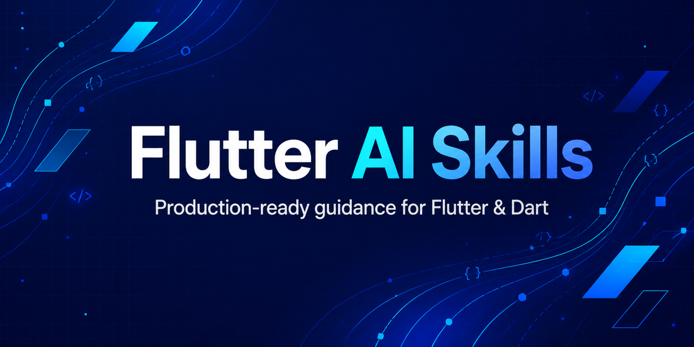

# Flutter Skills 🐦



A curated collection of production-focused AI skills for Flutter and Dart development. These skills help an AI coding assistant make sound implementation, debugging, security, performance, and release decisions across real-world Flutter applications.

## What’s included ✨

This repository contains **56 portable `.skill` packages**. Each package is a ZIP archive containing:

- `SKILL.md` — the skill’s scope, trigger conditions, and operating guidance.
- `references/` — focused material for version-sensitive, platform-specific, or advanced work where applicable.

The skills are designed for use with AI coding tools that support the `.skill` package format. They are not Flutter packages and do not need to be added to `pubspec.yaml`.

> **Important:** Keep each `.skill` archive intact. Do not unzip or modify it before importing it into a compatible tool.

## Getting started 🚀

1. Choose a skill from the catalog below that matches your Flutter or Dart task.
2. Download its `.skill` file directly from this repository, or from a GitHub Release when releases are available.
3. Import the archive using your AI coding tool’s skill-installation workflow.
4. Work normally—the skill’s trigger description determines when it should guide the assistant.

Installation screens and terminology vary between tools. Refer to your tool’s documentation if it does not offer an import or install action for skill archives.

### Flutter motion engineering

Download [Flutter motion engineering](skills/flutter-motion-engineering.skill) for source-backed guidance on Apple-quality motion, interruptible springs, gesture velocity, platform navigation, reduced motion, and rendering performance.

The package includes a core `SKILL.md`, three detailed reference guides, four Dart example files, and six regression tests under `references/examples/`. The examples passed formatting, analysis, and tests on Flutter 3.47.0 / Dart 3.13.0; application performance still requires profiling on target devices.

Use this skill for framework-level motion engineering. The separate [Flutter animations](skills/flutter-animations-production-engineering.skill) skill focuses on the Material `animations` package.

## Skill catalog

### Foundations and architecture

- [Dart args](skills/dart-args-production-cli.skill) — production command-line interfaces, subcommands, flags, and executable tooling.
- [Dart & Flutter Equatable](skills/dart-flutter-equatable-engineering.skill) — value equality, immutable state, and reliable rebuild behavior.
- [Freezed](skills/freezed-production-engineering.skill) — immutable models, sealed unions, JSON serialization, and code generation.
- [Dart & Flutter FFI](skills/dart-flutter-ffi-systems-engineering.skill) — native integration, memory ownership, ABI safety, and platform packaging.
- [Dart meta](skills/dart-meta.skill) — effective annotations, API contracts, immutability, and analyzer-guided modernization.
- [Senior Flutter architecture](skills/senior-flutter-architecture.skill) — production Flutter/Dart architecture with explicit trade-offs.
- [Senior mobile architecture](skills/senior-mobile-architecture.skill) — architecture reviews and refactoring across iOS, Android, and cross-platform apps.
- [Flutter production engineering](skills/flutter-production-engineering.skill) — production-grade Flutter and Dart engineering guidance for architecture, performance, scalability, cross-platform behavior, testing, profiling, and maintainability.
- [Flutter multi-environment](skills/flutter-multi-environment.skill) — development/staging/production flavors, configuration, and delivery pipelines.
- [Flutter package selection](skills/flutter-package-plugin-selection.skill) — evidence-based dependency evaluation and migration decisions.
- [Flutter lints & static analysis](skills/flutter-lints-static-analysis-engineering.skill) — analyzer configuration, lint governance, and CI quality gates.
- [Flutter production build & release](skills/flutter-production-build-release.skill) — production builds, signing, packaging, stores, and release recovery.
- [Flutter Firebase Core](skills/flutter-firebase-core-engineering.skill) — Firebase bootstrap, generated configuration, environments, and app-instance lifecycle.
- [Flutter mobile development](skills/flutter-mobile-development.skill) — practical Flutter delivery across app structure, UI, state, platform, testing, and release work.

### UI and user experience

- [HTML to Flutter](skills/html-to-flutter.skill) — production Flutter ports of HTML/CSS/JavaScript interfaces.
- [React to Flutter](skills/react-to-flutter.skill) — idiomatic, behavior-preserving React web migrations to Flutter.
- [Flutter animations](skills/flutter-animations-production-engineering.skill) — Material motion, transitions, accessibility, and animation performance.
- [Flutter motion engineering](skills/flutter-motion-engineering.skill) — Apple-quality interaction principles, interruptible springs, platform transitions, rendering diagnostics, accessibility, and tested Dart examples.
- [Flutter Confetti](skills/flutter-confetti-engineering.skill) — lifecycle-safe, accessible celebration effects and particle performance tuning.
- [Flutter native splash](skills/flutter-native-splash-engineering.skill) — Android, iOS, and Web launch resources, transitions, flavors, and startup behavior.
- [Flutter image performance](skills/flutter-image-performance.skill) — image loading, decoding, caching, rendering, and memory use.
- [Flutter image_picker](skills/flutter-image-picker-production-engineering.skill) — photo/video acquisition, lost-data recovery, platform behavior, and media safety.
- [Flutter pro_image_editor](skills/flutter-pro-image-editor-engineering.skill) — production image editing, state persistence, export, privacy, and large-image performance.
- [Flutter video_player](skills/flutter-video-player-production-engineering.skill) — cross-platform playback, controller lifecycle, streaming delivery, codecs, and decoder performance.
- [Flutter Skeletonizer](skills/flutter-skeletonizer-engineering.skill) — accessible, performant loading states.
- [Flutter SVG](skills/flutter-svg-engineering.skill) — rendering, theming, caching, performance, and SVG security.
- [Flutter design system from design.md](skills/flutter-design-system-from-design-md.skill) — converting a `design.md` spec into Flutter theme tokens, components, states, and validation checks.

### Performance and reliability

- [Flutter expert tips](skills/flutter-expert-tips.skill) — practical Flutter/Dart implementation, debugging, refactoring, and modernization guidance.
- [Flutter Firebase Analytics](skills/flutter-firebase-analytics.skill) — product-event schemas, consent, identity, screen and ecommerce measurement, DebugView, and reporting quality.
- [Flutter Sentry](skills/flutter-sentry-engineering.skill) — crash reporting, tracing, symbolication, privacy, and production observability.
- [Flutter concurrency, memory & performance](skills/flutter-concurrency-memory-performance.skill) — isolates, async workflows, lifecycle management, and resource efficiency.
- [Flutter caching](skills/flutter-caching-engineering.skill) — cache policy, invalidation, offline data, HTTP freshness, and resource bounds.
- [Flutter jank optimization](skills/flutter-performance-jank-optimization.skill) — profiling and fixing dropped frames, slow scrolling, and latency.
- [Flutter UI performance](skills/flutter-ui-performance-engineering.skill) — frame-budget analysis, rebuild/layout/paint/raster optimization, and production profiling.
- [Flutter memory leaks](skills/flutter-memory-leak-engineering.skill) — lifecycle defects, leak tracking, and regression prevention.
- [Flutter production logging](skills/flutter-production-logging.skill) — structured, privacy-conscious diagnostics and error reporting.
- [Flutter Squadron concurrency](skills/flutter-squadron-concurrency-engineering.skill) — workers, worker pools, cancellation, and web workers.

### Networking, navigation, and platform capabilities

- [Flutter Firebase Messaging](skills/flutter-firebase-messaging.skill) — reliable, secure FCM delivery across Android, iOS, macOS, and Web.
- [Flutter Dio](skills/flutter-dio-engineering.skill) — production HTTP clients, auth, retries, transfers, and observability.
- [Flutter Dio cache interceptor](skills/flutter-dio-cache-interceptor-engineering.skill) — source-grounded HTTP caching, revalidation, store selection, offline fallback, key isolation, and invalidation with `dio_cache_interceptor`.
- [Flutter go_router](skills/flutter-go-router-engineering.skill) — routing, deep links, redirects, nested navigation, and web URLs.
- [Flutter app links](skills/flutter-app-links-deep-link-engineering.skill) — Universal Links, Android App Links, and secure link delivery.
- [Flutter url_launcher](skills/flutter-url-launcher-engineering.skill) — safe external URI handling across platforms.
- [Flutter share_plus](skills/flutter-share-plus-engineering.skill) — cross-platform text, URI, file, and generated-content sharing.
- [Flutter WebView](skills/flutter-webview-production-engineering.skill) — embedded web content, navigation policy, security, and lifecycle.
- [Flutter local notifications](skills/flutter-local-notifications-production-engineering.skill) — permissions, scheduling, time zones, interactions, and recovery.
- [Flutter permission_handler](skills/flutter-permission-handler-engineering.skill) — runtime permissions, platform configuration, and privacy-aware flows.

### Storage, dependency injection, and security 🔒

- [Flutter Supabase](skills/flutter-supabase-engineering.skill) — Auth, RLS, database access, Realtime, Storage, Edge Functions, and production security.
- [Flutter Drift](skills/flutter-drift-persistence-engineering.skill) — relational persistence, reactive queries, migrations, concurrency, and cross-platform SQLite performance.
- [Flutter Hive](skills/flutter-hive-persistence-engineering.skill) — local persistence, schema changes, encryption, and recovery.
- [Flutter path_provider](skills/flutter-path-provider-production-storage.skill) — secure, durable filesystem storage and cleanup.
- [Flutter get_it & injectable](skills/flutter-get-it-injectable-dependency-injection.skill) — dependency lifetimes, scopes, startup, and testing.
- [Flutter secure storage](skills/flutter-secure-storage-security-engineering.skill) — protected credentials and platform key stores.
- [Flutter application security](skills/flutter-application-security-engineering.skill) — end-to-end application security reviews and remediation.
- [Flutter app hardening](skills/flutter-app-hardening-reverse-engineering.skill) — reverse-engineering resistance, tamper protection, and secure releases.

### Testing and delivery

- [Test before deploy](skills/test-before-deploy.skill) — select and review release-ready test coverage using the “34 Test Before Deploy” taxonomy.

## Repository structure

```text
skills/*.skill                  Distributable skill archives
.github/workflows/validate.yml  Archive validation on pushes and pull requests
PUBLISHING.md                   GitHub and release checklist
```

## Quality checks ✅

The GitHub Actions workflow validates every archive on pushes to `main` and on pull requests. It verifies that each package is a readable ZIP archive and contains exactly one top-level `SKILL.md` manifest.

Before submitting changes, run the same essential check locally:

```sh
for skill in skills/*.skill; do
  unzip -t "$skill"
  unzip -Z1 "$skill" | rg '^[^/]+/SKILL\.md$'
done
```

## Contributing

Contributions are welcome once a repository license is selected. When updating a skill, preserve its package structure and keep guidance accurate, actionable, and free of credentials, private project information, or customer data.

For the publishing and release process, see [PUBLISHING.md](PUBLISHING.md).

## License

Distributed under the [MIT License](LICENSE). See [CONTRIBUTING.md](CONTRIBUTING.md), [CODE_OF_CONDUCT.md](CODE_OF_CONDUCT.md), and [SECURITY.md](SECURITY.md) for participation and reporting guidelines.

## Personal skills landing page

This repository also includes a dependency-free portfolio page in `index.html`, `styles.css`, and `script.js`.

### Run locally

Open `index.html` directly, or serve the repository root with any static server:

```sh
python3 -m http.server 8000
```

Then visit `http://localhost:8000`.

### Customize it

- Replace the placeholder name, copy, links, and email in `index.html`.
- Edit the centralized `skills` array at the top of `script.js` to add, remove, or rename skills.
- Update the `categories` array in the same file when you need different overview groups.
- Change the color tokens at the top of `styles.css` to retheme the page.
- Replace the placeholder GitHub, LinkedIn, and email URLs in `index.html`, including the contribution CTA.
- Select catalog cards to generate copyable `curl` download commands for the chosen `.skill` archives; update `rawSkillsBase` in `script.js` if the repository moves.
- The command drawer also provides `wget`, `npx degit`, and Git sparse-checkout variants. `npx degit` downloads the complete `skills/` folder; the other variants support selected archives.

### Deploy to GitHub Pages

Push the repository to GitHub, open **Settings → Pages**, choose **Deploy from a branch**, select `main` and `/ (root)`, then save. GitHub Pages will serve `index.html` as the site entry point.
